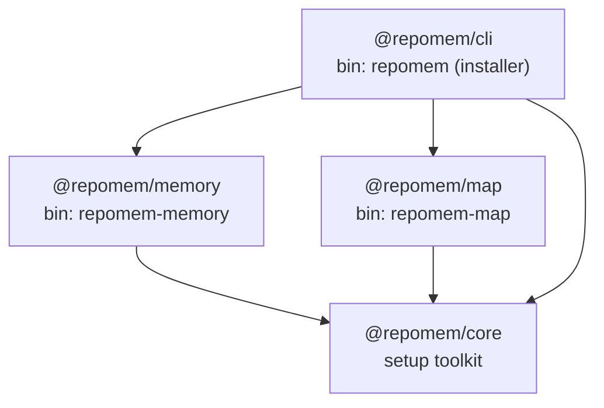

# repomem

**Your repo's memory and structure, available to every AI tool your team uses.**

`repomem` keeps a team's hard-won context — decisions, conventions, limitations,
learnings, and a map of *what lives where* — next to the code, in git, where both
humans and AI assistants can find it. It is exposed to AI tools through local
[Model Context Protocol](https://modelcontextprotocol.io) (MCP) servers, with no
external database and no API keys.

This repository is a monorepo (npm workspaces). All four packages are published
under the public [`@repomem`](https://www.npmjs.com/org/repomem) scope: three
library packages plus the [`@repomem/cli`](https://www.npmjs.com/package/@repomem/cli)
installer that wires them into your AI tool in one command.

## Packages

| Package | npm | CLI | What it does |
|---|---|---|---|
| [`@repomem/cli`](packages/installer/README.md) | [`@repomem/cli`](https://www.npmjs.com/package/@repomem/cli) | `repomem setup` | One-command installer. Interactively (or via flags) configures the memory and map servers for your agent. |
| [`@repomem/memory`](packages/memory/README.md) | [`@repomem/memory`](https://www.npmjs.com/package/@repomem/memory) | `repomem-memory` | Turns a `memory/` folder of reviewable markdown entries into searchable, shared context over MCP. |
| [`@repomem/map`](packages/map/README.md) | [`@repomem/map`](https://www.npmjs.com/package/@repomem/map) | `repomem-map` | Structure map and dependency graph: what each file is about and where a concept lives. Optional companion to `@repomem/memory`. |
| [`@repomem/core`](packages/core/README.md) | [`@repomem/core`](https://www.npmjs.com/package/@repomem/core) | — | Shared setup toolkit (idempotent filesystem helpers + agent installer) used by the two servers. Infrastructure only. |

See each package's README for its tools, configuration, and usage.

## How the packages relate

`memory` and `map` are independent MCP servers that each build their agent setup
on the same shared toolkit. Neither depends on the other. The `repomem`
installer is a thin orchestrator that configures both in one pass.



## Quick start

Install nothing — `npx` fetches everything on demand. Run the installer and
pick the servers to register with your AI tool (Kiro today; Claude Code and
other MCP clients are on the roadmap):

```bash
npx @repomem/cli setup                         # interactive: choose memory / map + agent
```

Prefer non-interactive (CI, scripts)? Pass the agent and the servers:

```bash
npx @repomem/cli setup --agent kiro --servers all      # both servers
npx @repomem/cli setup --agent kiro --servers memory   # just memory
```

To scaffold the reviewable `memory/` folder in your repo:

```bash
npx --package @repomem/memory repomem-memory init
```

You can also configure a single server directly, without the installer:

```bash
npx --package @repomem/memory repomem-memory setup --agent kiro
npx --package @repomem/map    repomem-map    setup --agent kiro
```

Full configuration and tool reference live in the per-package READMEs linked
above.

## Development

Requires **Node.js 22+**. From the repository root:

```bash
npm install        # install and link all workspaces
npm run build      # build every package (tsc / vite)
npm test           # run all workspace test suites (vitest)
npm run typecheck  # typecheck every package
```

Per-package scripts are available via `-w`, e.g. `npm run build -w @repomem/map`,
or the convenience aliases `npm run build:core`, `test:memory`, `typecheck:map`,
etc.

## Releasing

Publishing to npm is automated by a tag-triggered GitHub Actions workflow with
npm provenance. See [RELEASING.md](RELEASING.md) for the full process.

## Contributing

See [CONTRIBUTING.md](CONTRIBUTING.md) for the branching model, commit
conventions, and the test-driven workflow.

## License

[MIT](LICENSE)
